# WooxTravel 🌍✈️

**WooxTravel** seyahat ve tatil rezervasyonları için tasarlanmış modern bir web uygulamasıdır. Kullanıcılara çeşitli tatil destinasyonlarını keşfetme, inceleme ve rezervasyon yapma olanağı sunar. Güçlü özelliklerle donatılan platform, kullanıcılara kişisel hesap yönetimi ve dinamik içerik gösterimi gibi işlevler sağlar.

## Özellikler 🚀
- **Destinasyon Keşfi** 🏝️: Kullanıcılar popüler tatil noktalarını gezip inceleyebilir.
- **Kullanıcı Yönetimi** 👤: Kullanıcı oturum açma ve kayıt işlemleri.
- **Rezervasyon İşlemleri** 📝: Seçili destinasyon için rezervasyon yapma.

## Kullanılan Teknolojiler 🛠️

Bu proje, aşağıdaki teknolojileri kullanır:
- **ASP.NET MVC** ⚙️: Uygulamanın ana çerçevesi.
- **Entity Framework (Code First)** 🗄️: Veritabanı oluşturma ve yönetimi.
- **Paging ve Partial View** 📄: Dinamik içerik ve sayfalama özellikleri.
- **Areas ve Session Yönetimi** 🔒: Kullanıcı deneyimini iyileştiren oturum ve alan yönetimi.
- **Authorize Attribute** 🔑: Yetkilendirme mekanizması.
- **Bootstrap 5** 🎨: Modern, mobil uyumlu arayüz tasarımı.

## Ekran Görüntüleri

### Veri Tabanı
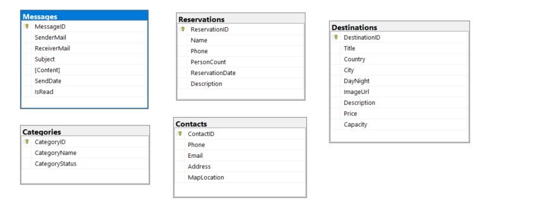

### Login Sayfası
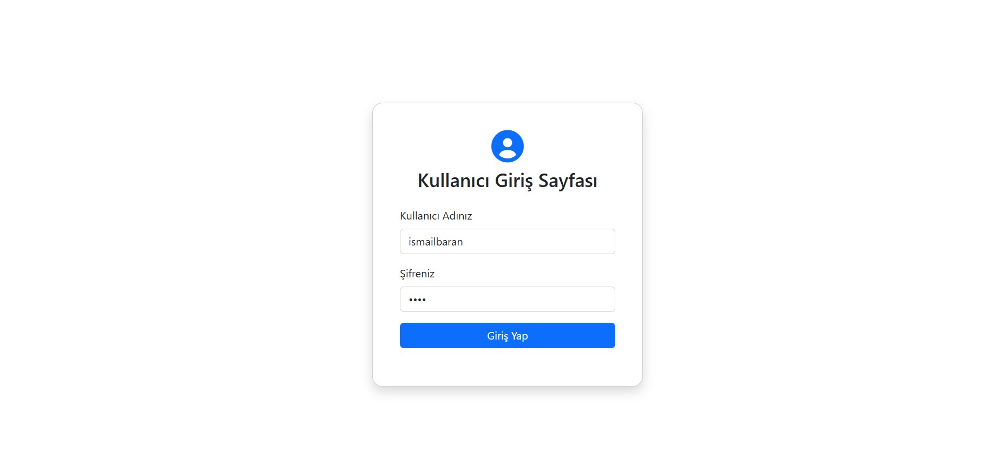
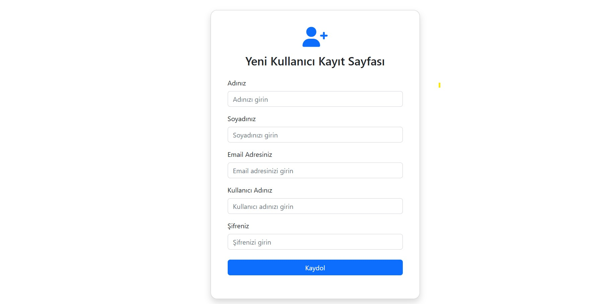

### Admin Paneli Görüntüsü
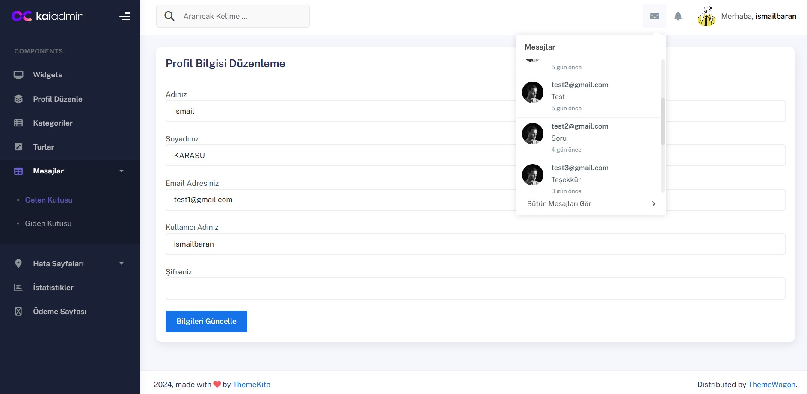
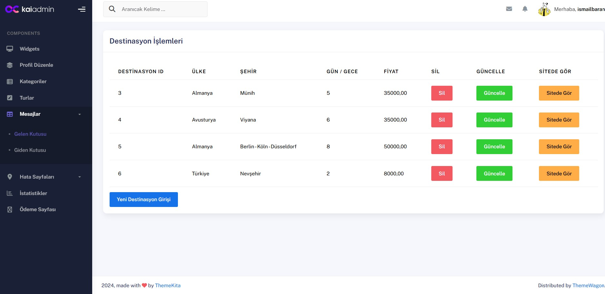
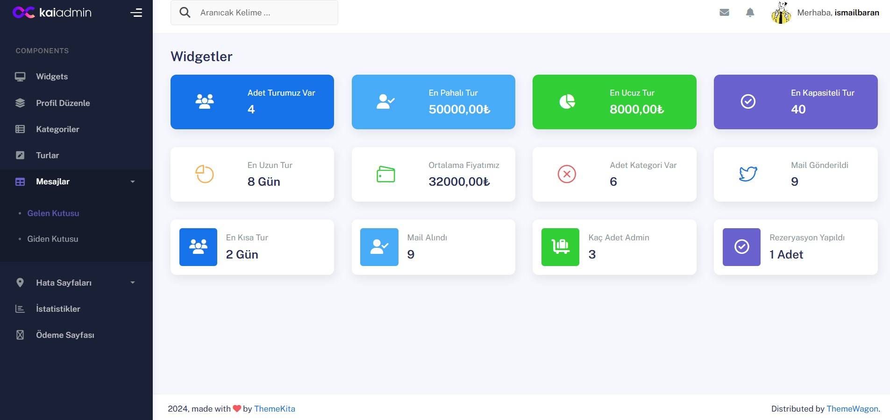
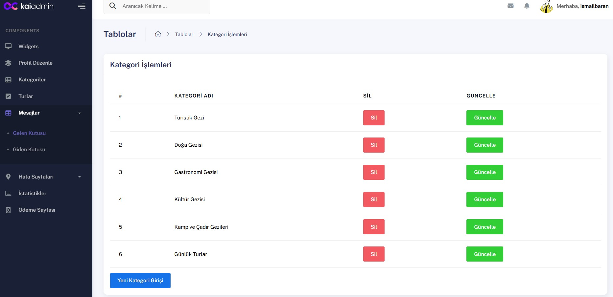
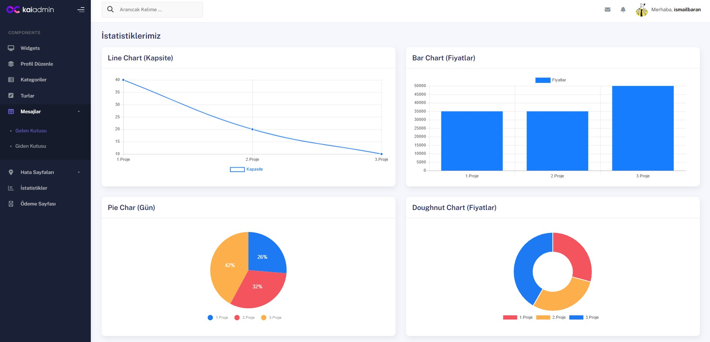
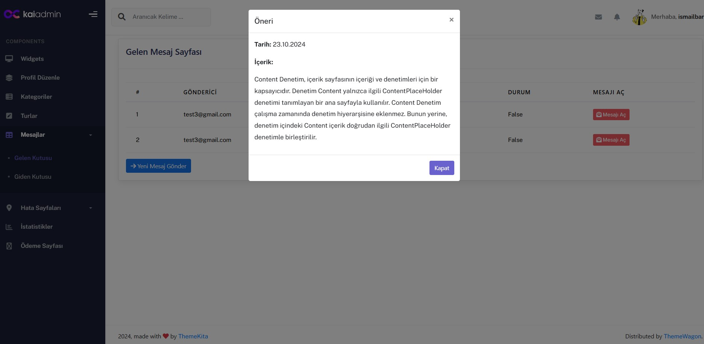

### Ödeme Sistemi Görüntüsü
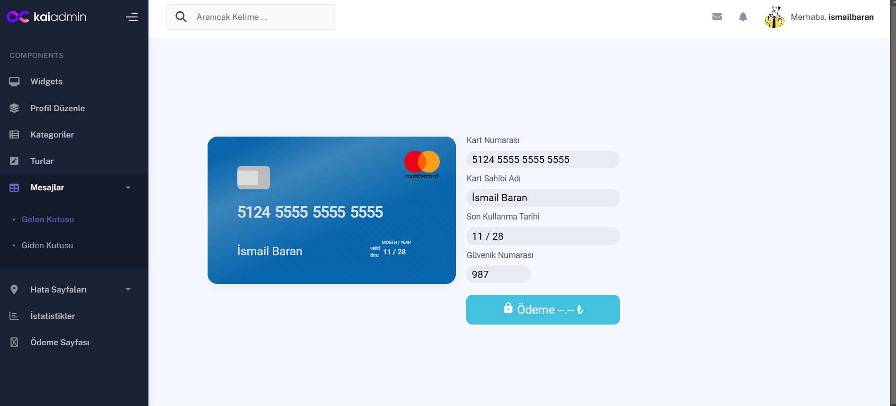
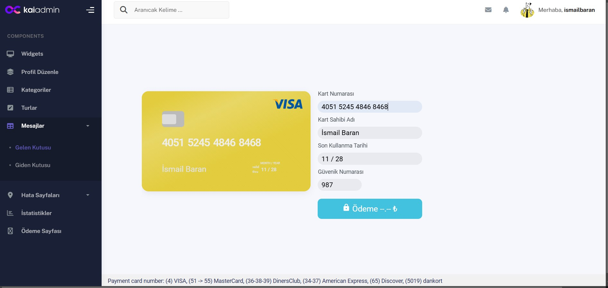

### Rezervasyon Görüntüsü
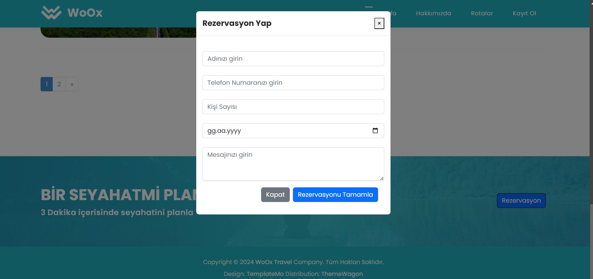
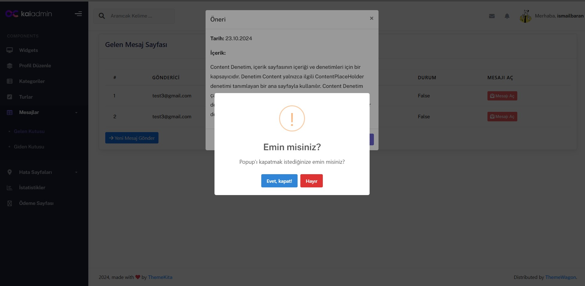


### UI Sayfaları
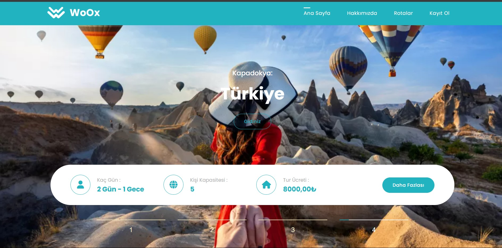
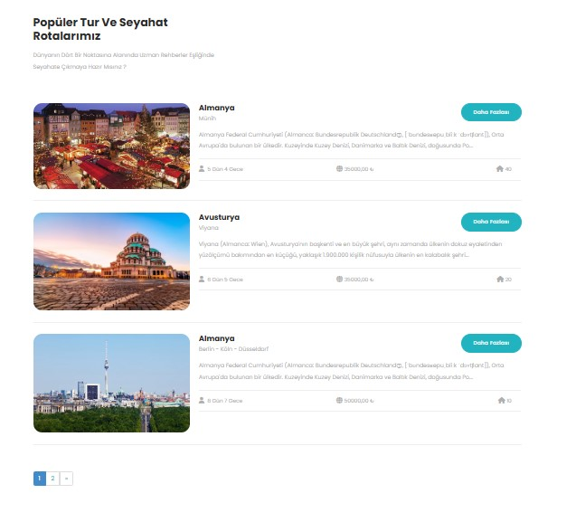


### Tur Detay Sayfaları
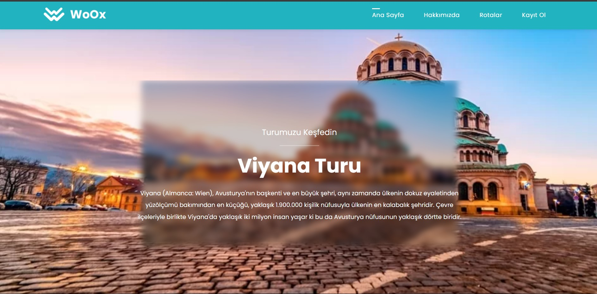
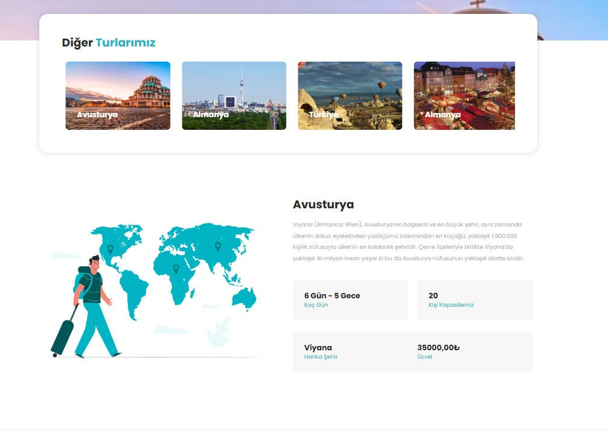

## Kurulum ⚡
1. Projeyi klonlayın.
   ```bash
   git clone https://github.com/DifferenTismail/WooxTravel.git
2. Proje klasörüne gidin:
    ```bash
    cd WooxTravel

3. Veritabanı yapılandırmalarını yapın ve SQL Server üzerinde çalıştırın.

4. Uygulamayı çalıştırın:
    ```bash
    dotnet run

## Katkıda Bulunma

Katkıda bulunmak isterseniz, lütfen bir **pull request** açın. Her türlü katkı memnuniyetle karşılanır.
